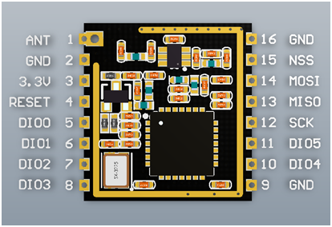
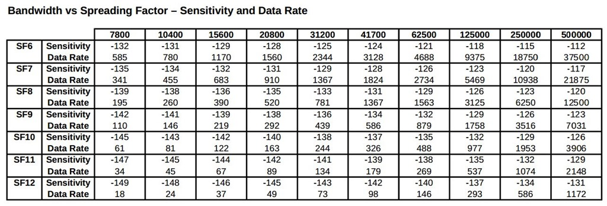
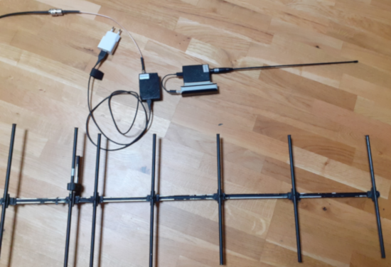

# LoRa APRS ESP32 KISS APRSDroid bluetooth modem, LoRa APRS-IS RX/TX iGate with digipeater
Amateur radio ESP32 based LoRa APRSDroid KISS Bluetooth modem + LoRa APRS-IS RX/TX iGate server over WiFI + digipeater

Can be used in two modes: 
- **LoRa APRS KISS client over bluetooth**, you need to use APRSDroid application (https://aprsdroid.org), connect to the modem using bluetooth, data will be re-transmitted through the LoRa radio, this is similar to APRSDroid micromodem - https://unsigned.io/micromodem/, received data will be sent back to the APRSDroid using bluetooth. By having two clients you can not only send your position, but also send and receive APRS messages. Alternatively, it is possible to use other KISS APRS clients over serial, just use `rfcomm` on Linux to setup serial over Bluetooth and put up AX25 interface with `kissattach`
- **LoRa APRS iGate RX/TX server + digipeater**
  - **RF to APRS-IS gating**, it will connect to WiFI and will forward received APRS positions from RF LoRAa into the APRS-IS network, it also reports client signal level, by appending it into the APRS comment, so you can see your signal reports in different locations (could be enabled or disabled from config)
  - **APRS-IS to RF gating**, it is possible to enable it together with the filter in the config, so APRS-IS data will be forwarded to RF
  - **RF digirepating** for basic `WIDEn-n` paths, `TRACE` and others are not supported yet
  - **Self beaconing**, own station periodic beacon announcement to APRS-IS and RF

# Compatible Boards
All work was done on ESP32-WROOM with custom made LoRa shield, if your ESP32 board is compatible then it should work, but there might be need to redefine pinouts to LoRa module if it differs (see further description in Software Setup section)

# Software Dependencies (install via libraries)
- Arduino ESP32 library: https://github.com/espressif/arduino-esp32
- LoRa arduino library: https://github.com/sandeepmistry/arduino-LoRa
- Arduino Timer library: https://github.com/contrem/arduino-timer

# Software Setup
- when setting up APRSDroid, use **"TNC (KISS)"** connection protocol in Connection Preferences -> Connection Protocol
- go to esp32_loraprs.ino and make next changes based on your requirements in `initializeConfig()`
  - set `cfg.IsClientMode` to `false` if you are planning to run server mode for APRS-IS iGate / Digipeater
  - for server mode fill `cfg.WifiSsid` and `cfg.WifiKey` with your WiFI AP data
  - for server mode fill `cfg.AprsLogin` and `cfg.AprsPass` with APRS-IS login callsign and pass
  - for server mode fill `cfg.AprsFilter`, see http://www.aprs-is.net/javAPRSFilter.aspx for various formats
  - change `cfg.LoraFreq` if you are planning to use different frequency or if planning to calibrate clients, currently it is set to **433.775MHz** as per https://vienna.iaru-r1.org/wp-content/uploads/2019/01/VIE19-C5-015-OEVSV-LORA-APRS-433-MHz.pdf
- if you are planning to use different esp32 pinouts then modify loraprs.h
  - lora module SS, **CfgPinSs**, pin 5
  - lora module RST, **CfgPinRst**, pin 26
  - lora module DIO0, **CfgPinDio0**, pin 14
- if you are planning to experiment with different bandwidths/spread factors then modify loraprs.h, with current parameters APRS packet time on air is around **2 seconds** to decode with as lower level as possible, use https://github.com/tanupoo/lorawan_toa to make calculations
  - lora bandwidth `cfg.LoraBw`, 125 kHz
  - lora spread factor `cfg.LoraSf`, 12 (should decode down to -20dB, choosen with the goal for minimum signal decode)
  - lora coding rate `cfg.LoraCodingRate`, 7
  - lora output power `cfg.LoraPower`, 20 (max 20 dBm ~ 100mW, change to lower value if needed)
  - sync word `cfg.LoraSync`, 0xf3
- consider minimum decode level based on on BW + SF 
- use 80 MHz ESP32 frequency in Arduino SDK, it will prolong battery life when operating portable, higher CPU speed is not required, there are no CPU intensive operations
- uses LoRa **built-in checksum** calculation to drop broken packets
- note, that there a is **significant frequency drift** on temperature changes for different modules
  - you need to use **external TCXO** if you are planning to use modules for narrow bandwidths less than 125 kHz 
  - or calibrate clients based on server frequency drift report by changing `cfg.LoraFreq`, for example, let client and server run for an 30-60 minutes and if server reports err: -1500, then set client frequency to about 1000 kHz less, e.g. instead of 433.775 set it to 433.774, this will give couple of additional dB
  - alternatively automatic calibration could be done on server or client side by enabling automatic frequency correction by setting `cfg.EnableAutoFreqCorrection` to `true`, might be suitable for experiments where only one client is operating or if server broadcast messages, so clients can correct their frequency
 - other useful options are
   - `cfg.EnableSignalReport` set to `true` to enable signal report, it will be added as a comment to APRS-IS submitted location
   - `cfg.EnablePersistentAprsConnection` set to `false` to avoid keeping connection open to APRS-IS
   - `cfg.EnableRfToIs` set to `true` to forward RF traffic to APRS-IS
   - `cfg.EnableIsToRf` set to `true` to forward APRS-IS traffic to RF, see also `cfg.AprsFilter` for traffic filtering
   - `cfg.EnableRepeater` set to `true` to enable packet repeater
   - `cfg.EnableBeacon` set to `true` to enable periodic beacons specified in `cfg.AprsRawBeacon` with period specified in `cfg.AprsRawBeaconPeriodMinutes` into RF and APRS-IS if `cfg.EnableRfToIs` is enabled

# Test Results

- Antennas
  - Client: rubber duck antenna or mobile antenna on a car roof
  - Server: 7 element UHF yagi indoors
- Range (20 KHz channel width and 9 spreading factor, also got similar results with 125 kHz and 12 SF)
  - **About 7 km** when server is 30m above the ground and client is 2m above the ground with rubber duck antenna or inside a car
  - **About 13 km** when server is 30m above the ground and client is at some higher point ~40m above the ground with rubber duck antenna
  - **About 17km** maximum (non-reliable) between base and mobile station with antenna on the car roof
  - **About 20km** over the sea between base and handheld
- Signal levels
  - Successful decodes down to **-19.75dB** below the noise floor when using compressed APRS coordinates (smaller packets, about 50 bytes, 32 bytes without PATH, speed, altitude), see APRSDroid discussions on compressed corrdinates support and custom branches
    - https://github.com/ge0rg/aprsdroid/pull/159
    - https://github.com/ge0rg/aprsdroid/issues/170
    - https://github.com/sh123/aprsdroid/tree/aprsdroid_compressed
    - https://github.com/sh123/aprsdroid/tree/aprsdroid_compressed_gradle
- Polarization
  - Using **horizontal polarization** improves successful decoding probability and receiving range
- Weather
  - Rain and high humidity levels decrease signal level by about **~3-6 dB**

